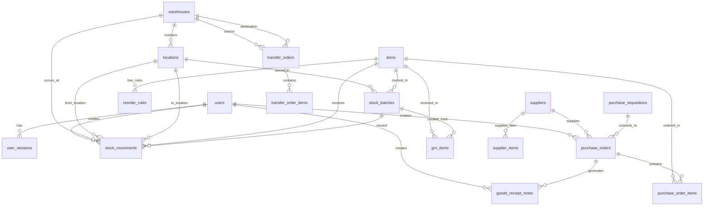

# IMRAS Database Schema Design

## Overview
This document outlines the comprehensive database schema for the Inventory Management & Reorder Automation System (IMRAS).

## Core Entities & Relationships



## Table Definitions

### 1. Users & Authentication

#### users
```sql
CREATE TABLE users (
    id UUID PRIMARY KEY DEFAULT gen_random_uuid(),
    email VARCHAR(255) UNIQUE NOT NULL,
    password_hash VARCHAR(255) NOT NULL,
    first_name VARCHAR(100) NOT NULL,
    last_name VARCHAR(100) NOT NULL,
    role user_role NOT NULL,
    phone VARCHAR(20),
    is_active BOOLEAN DEFAULT true,
    two_factor_enabled BOOLEAN DEFAULT false,
    two_factor_secret VARCHAR(255),
    last_login TIMESTAMP WITH TIME ZONE,
    created_at TIMESTAMP WITH TIME ZONE DEFAULT NOW(),
    updated_at TIMESTAMP WITH TIME ZONE DEFAULT NOW()
);

CREATE TYPE user_role AS ENUM ('warehouse_staff', 'inventory_manager', 'admin');
```

#### user_sessions
```sql
CREATE TABLE user_sessions (
    id UUID PRIMARY KEY DEFAULT gen_random_uuid(),
    user_id UUID NOT NULL REFERENCES users(id) ON DELETE CASCADE,
    session_token VARCHAR(255) UNIQUE NOT NULL,
    expires_at TIMESTAMP WITH TIME ZONE NOT NULL,
    ip_address INET,
    user_agent TEXT,
    created_at TIMESTAMP WITH TIME ZONE DEFAULT NOW()
);
```

### 2. Item Management

#### categories
```sql
CREATE TABLE categories (
    id UUID PRIMARY KEY DEFAULT gen_random_uuid(),
    name VARCHAR(100) NOT NULL,
    description TEXT,
    parent_category_id UUID REFERENCES categories(id),
    is_active BOOLEAN DEFAULT true,
    created_at TIMESTAMP WITH TIME ZONE DEFAULT NOW(),
    updated_at TIMESTAMP WITH TIME ZONE DEFAULT NOW()
);
```

#### items
```sql
CREATE TABLE items (
    id UUID PRIMARY KEY DEFAULT gen_random_uuid(),
    sku VARCHAR(50) UNIQUE NOT NULL,
    name VARCHAR(200) NOT NULL,
    description TEXT,
    category_id UUID REFERENCES categories(id),
    unit_of_measure VARCHAR(20) NOT NULL,
    weight DECIMAL(10,3),
    dimensions VARCHAR(50),
    barcode VARCHAR(100),
    qr_code VARCHAR(100),
    requires_batch_tracking BOOLEAN DEFAULT false,
    requires_serial_tracking BOOLEAN DEFAULT false,
    has_expiry BOOLEAN DEFAULT false,
    shelf_life_days INTEGER,
    standard_cost DECIMAL(15,2),
    selling_price DECIMAL(15,2),
    lead_time_days INTEGER DEFAULT 0,
    safety_stock DECIMAL(15,2) DEFAULT 0,
    reorder_point DECIMAL(15,2) DEFAULT 0,
    max_stock DECIMAL(15,2),
    min_stock DECIMAL(15,2),
    is_active BOOLEAN DEFAULT true,
    image_url TEXT,
    created_at TIMESTAMP WITH TIME ZONE DEFAULT NOW(),
    updated_at TIMESTAMP WITH TIME ZONE DEFAULT NOW()
);
```

### 3. Warehouse & Location Management

#### warehouses
```sql
CREATE TABLE warehouses (
    id UUID PRIMARY KEY DEFAULT gen_random_uuid(),
    name VARCHAR(100) NOT NULL,
    code VARCHAR(20) UNIQUE NOT NULL,
    address TEXT,
    city VARCHAR(100),
    state VARCHAR(100),
    country VARCHAR(100),
    postal_code VARCHAR(20),
    contact_person VARCHAR(100),
    contact_phone VARCHAR(20),
    contact_email VARCHAR(255),
    total_area DECIMAL(10,2),
    is_active BOOLEAN DEFAULT true,
    created_at TIMESTAMP WITH TIME ZONE DEFAULT NOW(),
    updated_at TIMESTAMP WITH TIME ZONE DEFAULT NOW()
);
```

#### locations
```sql
CREATE TABLE locations (
    id UUID PRIMARY KEY DEFAULT gen_random_uuid(),
    warehouse_id UUID NOT NULL REFERENCES warehouses(id) ON DELETE CASCADE,
    zone VARCHAR(50),
    aisle VARCHAR(20),
    rack VARCHAR(20),
    bin VARCHAR(20),
    location_type location_type_enum DEFAULT 'storage',
    capacity DECIMAL(15,2),
    current_capacity DECIMAL(15,2) DEFAULT 0,
    is_active BOOLEAN DEFAULT true,
    created_at TIMESTAMP WITH TIME ZONE DEFAULT NOW(),
    updated_at TIMESTAMP WITH TIME ZONE DEFAULT NOW(),
    UNIQUE(warehouse_id, zone, aisle, rack, bin)
);

CREATE TYPE location_type_enum AS ENUM ('storage', 'receiving', 'shipping', 'quarantine', 'picking');
```

### 4. Stock Management

#### stock_batches
```sql
CREATE TABLE stock_batches (
    id UUID PRIMARY KEY DEFAULT gen_random_uuid(),
    item_id UUID NOT NULL REFERENCES items(id),
    location_id UUID REFERENCES locations(id),
    batch_number VARCHAR(100),
    serial_number VARCHAR(100),
    manufacture_date DATE,
    expiry_date DATE,
    quantity DECIMAL(15,2) NOT NULL DEFAULT 0,
    reserved_quantity DECIMAL(15,2) DEFAULT 0,
    available_quantity DECIMAL(15,2) GENERATED ALWAYS AS (quantity - reserved_quantity) STORED,
    unit_cost DECIMAL(15,2),
    status batch_status DEFAULT 'active',
    created_at TIMESTAMP WITH TIME ZONE DEFAULT NOW(),
    updated_at TIMESTAMP WITH TIME ZONE DEFAULT NOW(),
    UNIQUE(item_id, batch_number),
    UNIQUE(item_id, serial_number)
);

CREATE TYPE batch_status AS ENUM ('active', 'quarantined', 'expired', 'consumed');
```

#### stock_movements
```sql
CREATE TABLE stock_movements (
    id UUID PRIMARY KEY DEFAULT gen_random_uuid(),
    item_id UUID NOT NULL REFERENCES items(id),
    batch_id UUID REFERENCES stock_batches(id),
    from_location_id UUID REFERENCES locations(id),
    to_location_id UUID REFERENCES locations(id),
    movement_type movement_type_enum NOT NULL,
    quantity DECIMAL(15,2) NOT NULL,
    reference_type VARCHAR(50),
    reference_id UUID,
    reason TEXT,
    performed_by UUID NOT NULL REFERENCES users(id),
    movement_date TIMESTAMP WITH TIME ZONE DEFAULT NOW(),
    created_at TIMESTAMP WITH TIME ZONE DEFAULT NOW()
);

CREATE TYPE movement_type_enum AS ENUM ('in', 'out', 'transfer', 'adjustment', 'return');
```

### 5. Supplier Management

#### suppliers
```sql
CREATE TABLE suppliers (
    id UUID PRIMARY KEY DEFAULT gen_random_uuid(),
    name VARCHAR(200) NOT NULL,
    code VARCHAR(50) UNIQUE,
    contact_person VARCHAR(100),
    email VARCHAR(255),
    phone VARCHAR(20),
    address TEXT,
    city VARCHAR(100),
    state VARCHAR(100),
    country VARCHAR(100),
    postal_code VARCHAR(20),
    website VARCHAR(255),
    tax_id VARCHAR(50),
    payment_terms VARCHAR(100),
    lead_time_days INTEGER DEFAULT 0,
    quality_rating DECIMAL(3,2) DEFAULT 0,
    delivery_rating DECIMAL(3,2) DEFAULT 0,
    is_active BOOLEAN DEFAULT true,
    created_at TIMESTAMP WITH TIME ZONE DEFAULT NOW(),
    updated_at TIMESTAMP WITH TIME ZONE DEFAULT NOW()
);
```

#### supplier_items
```sql
CREATE TABLE supplier_items (
    id UUID PRIMARY KEY DEFAULT gen_random_uuid(),
    supplier_id UUID NOT NULL REFERENCES suppliers(id) ON DELETE CASCADE,
    item_id UUID NOT NULL REFERENCES items(id) ON DELETE CASCADE,
    supplier_sku VARCHAR(100),
    unit_price DECIMAL(15,2),
    min_order_quantity DECIMAL(15,2),
    packaging_unit VARCHAR(50),
    lead_time_days INTEGER,
    is_preferred BOOLEAN DEFAULT false,
    is_active BOOLEAN DEFAULT true,
    created_at TIMESTAMP WITH TIME ZONE DEFAULT NOW(),
    updated_at TIMESTAMP WITH TIME ZONE DEFAULT NOW(),
    UNIQUE(supplier_id, item_id)
);
```

### 6. Purchase Management

#### purchase_requisitions
```sql
CREATE TABLE purchase_requisitions (
    id UUID PRIMARY KEY DEFAULT gen_random_uuid(),
    requisition_number VARCHAR(50) UNIQUE NOT NULL,
    requested_by UUID NOT NULL REFERENCES users(id),
    department VARCHAR(100),
    priority priority_enum DEFAULT 'medium',
    status pr_status DEFAULT 'draft',
    total_amount DECIMAL(15,2) DEFAULT 0,
    currency VARCHAR(3) DEFAULT 'USD',
    required_date DATE,
    justification TEXT,
    approved_by UUID REFERENCES users(id),
    approved_at TIMESTAMP WITH TIME ZONE,
    created_at TIMESTAMP WITH TIME ZONE DEFAULT NOW(),
    updated_at TIMESTAMP WITH TIME ZONE DEFAULT NOW()
);

CREATE TYPE priority_enum AS ENUM ('low', 'medium', 'high', 'urgent');
CREATE TYPE pr_status AS ENUM ('draft', 'submitted', 'approved', 'rejected', 'converted_to_po');
```

#### purchase_orders
```sql
CREATE TABLE purchase_orders (
    id UUID PRIMARY KEY DEFAULT gen_random_uuid(),
    po_number VARCHAR(50) UNIQUE NOT NULL,
    supplier_id UUID NOT NULL REFERENCES suppliers(id),
    warehouse_id UUID REFERENCES warehouses(id),
    status po_status DEFAULT 'draft',
    priority priority_enum DEFAULT 'medium',
    order_date DATE DEFAULT CURRENT_DATE,
    expected_delivery_date DATE,
    actual_delivery_date DATE,
    total_amount DECIMAL(15,2) DEFAULT 0,
    tax_amount DECIMAL(15,2) DEFAULT 0,
    discount_amount DECIMAL(15,2) DEFAULT 0,
    final_amount DECIMAL(15,2) DEFAULT 0,
    currency VARCHAR(3) DEFAULT 'USD',
    payment_terms VARCHAR(100),
    delivery_terms VARCHAR(100),
    notes TEXT,
    created_by UUID NOT NULL REFERENCES users(id),
    approved_by UUID REFERENCES users(id),
    approved_at TIMESTAMP WITH TIME ZONE,
    created_at TIMESTAMP WITH TIME ZONE DEFAULT NOW(),
    updated_at TIMESTAMP WITH TIME ZONE DEFAULT NOW()
);

CREATE TYPE po_status AS ENUM ('draft', 'sent', 'confirmed', 'partially_received', 'completed', 'cancelled');
```

#### purchase_order_items
```sql
CREATE TABLE purchase_order_items (
    id UUID PRIMARY KEY DEFAULT gen_random_uuid(),
    po_id UUID NOT NULL REFERENCES purchase_orders(id) ON DELETE CASCADE,
    item_id UUID NOT NULL REFERENCES items(id),
    quantity_ordered DECIMAL(15,2) NOT NULL,
    quantity_received DECIMAL(15,2) DEFAULT 0,
    unit_price DECIMAL(15,2) NOT NULL,
    tax_rate DECIMAL(5,2) DEFAULT 0,
    discount_rate DECIMAL(5,2) DEFAULT 0,
    total_amount DECIMAL(15,2) GENERATED ALWAYS AS (quantity_ordered * unit_price * (1 - discount_rate/100) * (1 + tax_rate/100)) STORED,
    expected_date DATE,
    notes TEXT,
    created_at TIMESTAMP WITH TIME ZONE DEFAULT NOW(),
    updated_at TIMESTAMP WITH TIME ZONE DEFAULT NOW()
);
```

#### goods_receipt_notes
```sql
CREATE TABLE goods_receipt_notes (
    id UUID PRIMARY KEY DEFAULT gen_random_uuid(),
    grn_number VARCHAR(50) UNIQUE NOT NULL,
    po_id UUID REFERENCES purchase_orders(id),
    warehouse_id UUID NOT NULL REFERENCES warehouses(id),
    received_by UUID NOT NULL REFERENCES users(id),
    received_date DATE DEFAULT CURRENT_DATE,
    carrier VARCHAR(100),
    vehicle_number VARCHAR(50),
    notes TEXT,
    status grn_status DEFAULT 'draft',
    created_at TIMESTAMP WITH TIME ZONE DEFAULT NOW(),
    updated_at TIMESTAMP WITH TIME ZONE DEFAULT NOW()
);

CREATE TYPE grn_status AS ENUM ('draft', 'confirmed', 'rejected');
```

#### grn_items
```sql
CREATE TABLE grn_items (
    id UUID PRIMARY KEY DEFAULT gen_random_uuid(),
    grn_id UUID NOT NULL REFERENCES goods_receipt_notes(id) ON DELETE CASCADE,
    po_item_id UUID REFERENCES purchase_order_items(id),
    item_id UUID NOT NULL REFERENCES items(id),
    batch_id UUID REFERENCES stock_batches(id),
    quantity_ordered DECIMAL(15,2),
    quantity_received DECIMAL(15,2) NOT NULL,
    quantity_accepted DECIMAL(15,2) NOT NULL,
    quantity_rejected DECIMAL(15,2) DEFAULT 0,
    batch_number VARCHAR(100),
    serial_number VARCHAR(100),
    manufacture_date DATE,
    expiry_date DATE,
    unit_cost DECIMAL(15,2),
    rejection_reason TEXT,
    location_id UUID REFERENCES locations(id),
    created_at TIMESTAMP WITH TIME ZONE DEFAULT NOW()
);
```

### 7. Transfer Management

#### transfer_orders
```sql
CREATE TABLE transfer_orders (
    id UUID PRIMARY KEY DEFAULT gen_random_uuid(),
    transfer_number VARCHAR(50) UNIQUE NOT NULL,
    from_warehouse_id UUID NOT NULL REFERENCES warehouses(id),
    to_warehouse_id UUID NOT NULL REFERENCES warehouses(id),
    status transfer_status DEFAULT 'draft',
    priority priority_enum DEFAULT 'medium',
    transfer_date DATE DEFAULT CURRENT_DATE,
    expected_date DATE,
    requested_by UUID NOT NULL REFERENCES users(id),
    approved_by UUID REFERENCES users(id),
    approved_at TIMESTAMP WITH TIME ZONE,
    notes TEXT,
    created_at TIMESTAMP WITH TIME ZONE DEFAULT NOW(),
    updated_at TIMESTAMP WITH TIME ZONE DEFAULT NOW()
);

CREATE TYPE transfer_status AS ENUM ('draft', 'approved', 'in_transit', 'partially_received', 'completed', 'cancelled');
```

#### transfer_order_items
```sql
CREATE TABLE transfer_order_items (
    id UUID PRIMARY KEY DEFAULT gen_random_uuid(),
    transfer_id UUID NOT NULL REFERENCES transfer_orders(id) ON DELETE CASCADE,
    item_id UUID NOT NULL REFERENCES items(id),
    batch_id UUID REFERENCES stock_batches(id),
    quantity_requested DECIMAL(15,2) NOT NULL,
    quantity_sent DECIMAL(15,2) DEFAULT 0,
    quantity_received DECIMAL(15,2) DEFAULT 0,
    from_location_id UUID REFERENCES locations(id),
    to_location_id UUID REFERENCES locations(id),
    notes TEXT,
    created_at TIMESTAMP WITH TIME ZONE DEFAULT NOW(),
    updated_at TIMESTAMP WITH TIME ZONE DEFAULT NOW()
);
```

### 8. Reorder & Automation

#### reorder_rules
```sql
CREATE TABLE reorder_rules (
    id UUID PRIMARY KEY DEFAULT gen_random_uuid(),
    item_id UUID NOT NULL REFERENCES items(id) ON DELETE CASCADE,
    warehouse_id UUID REFERENCES warehouses(id) ON DELETE CASCADE,
    rule_type rule_type_enum NOT NULL,
    min_stock DECIMAL(15,2),
    max_stock DECIMAL(15,2),
    reorder_point DECIMAL(15,2),
    reorder_quantity DECIMAL(15,2),
    safety_stock DECIMAL(15,2),
    lead_time_days INTEGER,
    service_level_percent DECIMAL(5,2) DEFAULT 95,
    demand_forecast_days INTEGER DEFAULT 30,
    is_active BOOLEAN DEFAULT true,
    auto_create_po BOOLEAN DEFAULT false,
    preferred_supplier_id UUID REFERENCES suppliers(id),
    created_at TIMESTAMP WITH TIME ZONE DEFAULT NOW(),
    updated_at TIMESTAMP WITH TIME ZONE DEFAULT NOW(),
    UNIQUE(item_id, warehouse_id)
);

CREATE TYPE rule_type_enum AS ENUM ('min_max', 'reorder_point', 'dynamic');
```

#### alerts
```sql
CREATE TABLE alerts (
    id UUID PRIMARY KEY DEFAULT gen_random_uuid(),
    alert_type alert_type_enum NOT NULL,
    title VARCHAR(200) NOT NULL,
    message TEXT NOT NULL,
    entity_type VARCHAR(50),
    entity_id UUID,
    warehouse_id UUID REFERENCES warehouses(id),
    item_id UUID REFERENCES items(id),
    severity severity_enum DEFAULT 'medium',
    status alert_status DEFAULT 'active',
    acknowledged_by UUID REFERENCES users(id),
    acknowledged_at TIMESTAMP WITH TIME ZONE,
    resolved_by UUID REFERENCES users(id),
    resolved_at TIMESTAMP WITH TIME ZONE,
    created_at TIMESTAMP WITH TIME ZONE DEFAULT NOW()
);

CREATE TYPE alert_type_enum AS ENUM ('low_stock', 'out_of_stock', 'expiry_warning', 'expired', 'reorder_required', 'quality_issue');
CREATE TYPE severity_enum AS ENUM ('low', 'medium', 'high', 'critical');
CREATE TYPE alert_status AS ENUM ('active', 'acknowledged', 'resolved');
```

### 9. System Configuration & Audit

#### system_settings
```sql
CREATE TABLE system_settings (
    id UUID PRIMARY KEY DEFAULT gen_random_uuid(),
    setting_key VARCHAR(100) UNIQUE NOT NULL,
    setting_value TEXT,
    setting_type setting_type_enum DEFAULT 'string',
    description TEXT,
    is_editable BOOLEAN DEFAULT true,
    updated_by UUID REFERENCES users(id),
    updated_at TIMESTAMP WITH TIME ZONE DEFAULT NOW()
);

CREATE TYPE setting_type_enum AS ENUM ('string', 'number', 'boolean', 'json');
```

#### audit_logs
```sql
CREATE TABLE audit_logs (
    id UUID PRIMARY KEY DEFAULT gen_random_uuid(),
    table_name VARCHAR(50) NOT NULL,
    record_id UUID NOT NULL,
    operation operation_enum NOT NULL,
    old_values JSONB,
    new_values JSONB,
    changed_by UUID REFERENCES users(id),
    changed_at TIMESTAMP WITH TIME ZONE DEFAULT NOW(),
    ip_address INET,
    user_agent TEXT
);

CREATE TYPE operation_enum AS ENUM ('INSERT', 'UPDATE', 'DELETE');
```

## Indexes

### Performance Indexes
```sql
-- Users
CREATE INDEX idx_users_email ON users(email);
CREATE INDEX idx_users_role ON users(role);
CREATE INDEX idx_users_active ON users(is_active);

-- Items
CREATE INDEX idx_items_sku ON items(sku);
CREATE INDEX idx_items_category ON items(category_id);
CREATE INDEX idx_items_active ON items(is_active);
CREATE INDEX idx_items_name_search ON items USING gin(to_tsvector('english', name));

-- Stock
CREATE INDEX idx_stock_batches_item ON stock_batches(item_id);
CREATE INDEX idx_stock_batches_location ON stock_batches(location_id);
CREATE INDEX idx_stock_batches_expiry ON stock_batches(expiry_date);
CREATE INDEX idx_stock_movements_item ON stock_movements(item_id);
CREATE INDEX idx_stock_movements_date ON stock_movements(movement_date);

-- Purchase Orders
CREATE INDEX idx_purchase_orders_supplier ON purchase_orders(supplier_id);
CREATE INDEX idx_purchase_orders_status ON purchase_orders(status);
CREATE INDEX idx_purchase_orders_date ON purchase_orders(order_date);

-- Alerts
CREATE INDEX idx_alerts_type ON alerts(alert_type);
CREATE INDEX idx_alerts_status ON alerts(status);
CREATE INDEX idx_alerts_severity ON alerts(severity);
CREATE INDEX idx_alerts_created ON alerts(created_at);
```

## Constraints & Triggers

### Check Constraints
```sql
-- Stock quantity validations
ALTER TABLE stock_batches ADD CONSTRAINT chk_positive_quantity CHECK (quantity >= 0);
ALTER TABLE stock_batches ADD CONSTRAINT chk_positive_reserved CHECK (reserved_quantity >= 0);
ALTER TABLE stock_batches ADD CONSTRAINT chk_reserved_not_greater CHECK (reserved_quantity <= quantity);

-- Price validations
ALTER TABLE items ADD CONSTRAINT chk_positive_cost CHECK (standard_cost >= 0);
ALTER TABLE items ADD CONSTRAINT chk_positive_price CHECK (selling_price >= 0);

-- Date validations
ALTER TABLE stock_batches ADD CONSTRAINT chk_expiry_after_manufacture CHECK (expiry_date IS NULL OR manufacture_date IS NULL OR expiry_date > manufacture_date);
```

### Triggers for Audit
```sql
-- Audit trigger function (example)
CREATE OR REPLACE FUNCTION audit_trigger_function()
RETURNS TRIGGER AS $$
BEGIN
    IF TG_OP = 'INSERT' THEN
        INSERT INTO audit_logs (table_name, record_id, operation, new_values, changed_by, changed_at)
        VALUES (TG_TABLE_NAME, NEW.id, 'INSERT', row_to_json(NEW), NEW.created_by, NOW());
        RETURN NEW;
    ELSIF TG_OP = 'UPDATE' THEN
        INSERT INTO audit_logs (table_name, record_id, operation, old_values, new_values, changed_by, changed_at)
        VALUES (TG_TABLE_NAME, NEW.id, 'UPDATE', row_to_json(OLD), row_to_json(NEW), NEW.updated_by, NOW());
        RETURN NEW;
    ELSIF TG_OP = 'DELETE' THEN
        INSERT INTO audit_logs (table_name, record_id, operation, old_values, changed_by, changed_at)
        VALUES (TG_TABLE_NAME, OLD.id, 'DELETE', row_to_json(OLD), OLD.created_by, NOW());
        RETURN OLD;
    END IF;
    RETURN NULL;
END;
$$ LANGUAGE plpgsql;

-- Apply triggers to key tables
CREATE TRIGGER audit_users AFTER INSERT OR UPDATE OR DELETE ON users FOR EACH ROW EXECUTE FUNCTION audit_trigger_function();
CREATE TRIGGER audit_items AFTER INSERT OR UPDATE OR DELETE ON items FOR EACH ROW EXECUTE FUNCTION audit_trigger_function();
CREATE TRIGGER audit_stock_batches AFTER INSERT OR UPDATE OR DELETE ON stock_batches FOR EACH ROW EXECUTE FUNCTION audit_trigger_function();
```

## Row Level Security (RLS) Policies

### Enable RLS on Sensitive Tables
```sql
-- Enable RLS
ALTER TABLE users ENABLE ROW LEVEL SECURITY;
ALTER TABLE stock_batches ENABLE ROW LEVEL SECURITY;
ALTER TABLE stock_movements ENABLE ROW LEVEL SECURITY;
ALTER TABLE purchase_orders ENABLE ROW LEVEL SECURITY;
ALTER TABLE salaries ENABLE ROW LEVEL SECURITY;

-- Example RLS Policies
CREATE POLICY "Users can view their own profile" ON users
    FOR SELECT USING (auth.uid() = id);

CREATE POLICY "Warehouse staff can view stock in their warehouse" ON stock_batches
    FOR SELECT USING (
        EXISTS (
            SELECT 1 FROM user_warehouse_access 
            WHERE user_id = auth.uid() 
            AND warehouse_id = (SELECT warehouse_id FROM locations WHERE id = stock_batches.location_id)
        )
    );

CREATE POLICY "Inventory managers can view all stock" ON stock_batches
    FOR SELECT USING (
        EXISTS (
            SELECT 1 FROM users 
            WHERE id = auth.uid() 
            AND role = 'inventory_manager'
        )
    );
```

## Views for Common Queries

### Stock Status View
```sql
CREATE VIEW stock_status AS
SELECT 
    i.id as item_id,
    i.sku,
    i.name as item_name,
    c.name as category_name,
    COALESCE(SUM(sb.quantity), 0) as total_quantity,
    COALESCE(SUM(sb.reserved_quantity), 0) as reserved_quantity,
    COALESCE(SUM(sb.available_quantity), 0) as available_quantity,
    i.reorder_point,
    i.safety_stock,
    CASE 
        WHEN COALESCE(SUM(sb.available_quantity), 0) = 0 THEN 'out_of_stock'
        WHEN COALESCE(SUM(sb.available_quantity), 0) <= i.reorder_point THEN 'low_stock'
        ELSE 'in_stock'
    END as stock_status
FROM items i
LEFT JOIN categories c ON i.category_id = c.id
LEFT JOIN stock_batches sb ON i.id = sb.item_id AND sb.status = 'active'
WHERE i.is_active = true
GROUP BY i.id, i.sku, i.name, c.name, i.reorder_point, i.safety_stock;
```

### Supplier Performance View
```sql
CREATE VIEW supplier_performance AS
SELECT 
    s.id as supplier_id,
    s.name as supplier_name,
    COUNT(po.id) as total_orders,
    SUM(po.final_amount) as total_value,
    AVG(po.final_amount) as avg_order_value,
    COUNT(CASE WHEN po.status = 'completed' THEN 1 END) as completed_orders,
    AVG(EXTRACT(DAY FROM po.actual_delivery_date - po.expected_delivery_date)) as avg_delivery_days,
    s.quality_rating,
    s.delivery_rating
FROM suppliers s
LEFT JOIN purchase_orders po ON s.id = po.supplier_id
WHERE s.is_active = true
GROUP BY s.id, s.name, s.quality_rating, s.delivery_rating;
```

## Initial Seed Data

### Default System Settings
```sql
INSERT INTO system_settings (setting_key, setting_value, setting_type, description) VALUES
('company_name', 'Your Company Name', 'string', 'Company name for reports and invoices'),
('default_currency', 'USD', 'string', 'Default currency for transactions'),
('low_stock_alert_threshold', '0.8', 'number', 'Alert when stock falls below 80% of reorder point'),
('expiry_warning_days', '30', 'number', 'Warn about items expiring within X days'),
('auto_approve_low_value_po', '1000', 'number', 'Auto-approve POs below this value'),
('default_lead_time_days', '7', 'number', 'Default supplier lead time in days');
```

### Default Admin User
```sql
INSERT INTO users (email, password_hash, first_name, last_name, role) VALUES
('admin@company.com', '$2b$12$hashed_password_here', 'System', 'Administrator', 'admin');
```

This comprehensive schema provides:
- Complete role-based access control
- Full inventory tracking with batch/serial/expiry support
- Purchase order workflow from requisition to receipt
- Transfer order management between warehouses
- Automated reorder rules and alerts
- Audit logging for compliance
- Performance-optimized indexes
- Row-level security for data protection
