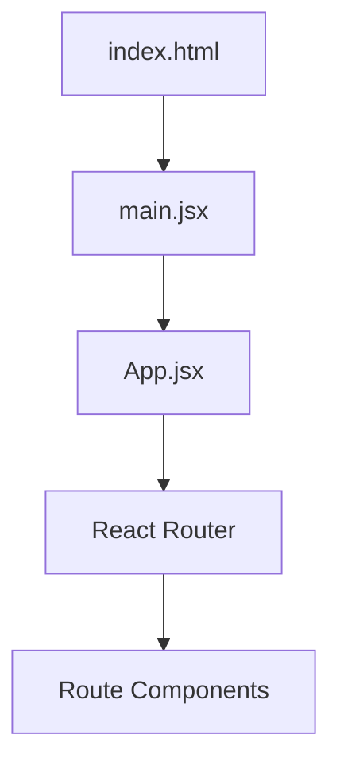
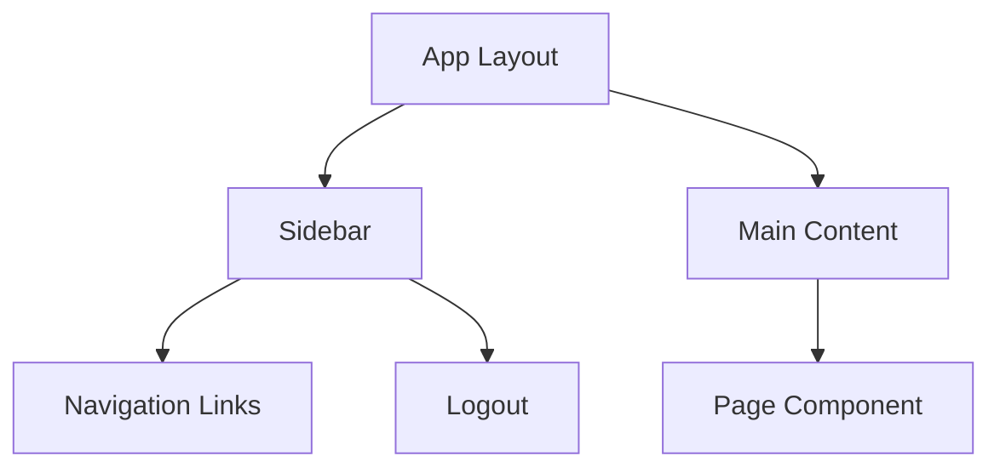
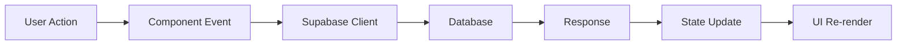
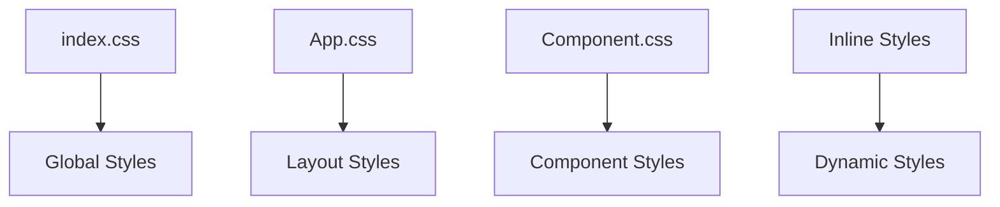
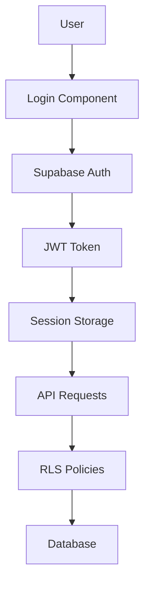

# Frontend Architecture Documentation

## **Technology Stack**

### **Core Framework**
- **React 19.1.0** - UI framework with modern hooks and concurrent features
- **Vite 6.3.5** - Build tool and development server
- **React Router DOM 7.11.0** - Client-side routing

### **State Management**
- **React Hooks** - Local component state (useState, useEffect)
- **Supabase Client** - Authentication and real-time data
- **Component State** - No global state management library

### **Styling**
- **CSS Modules** - Component-scoped styles
- **Inline Styles** - Dynamic styling in JSX
- **Global CSS** - App.css and index.css for base styles

### **Data & Backend**
- **Supabase 2.89.0** - Database, auth, and real-time subscriptions
- **REST API** - Direct Supabase client calls
- **Real-time** - Polling-based updates (30-second intervals)

### **Utilities**
- **jsPDF 3.0.4** - PDF report generation
- **Recharts 3.6.0** - Data visualization
- **ESLint** - Code quality and linting

## **Project Structure**

```
frontend/
├── public/
│   └── favicon.ico
├── src/
│   ├── assets/
│   │   └── react.svg
│   ├── components/
│   │   ├── Header.jsx
│   │   ├── Modal.jsx
│   │   ├── Sidebar.jsx
│   │   ├── header.css
│   │   ├── modal.css
│   │   └── sidebar.css
│   ├── pages/
│   │   ├── Dashboard.jsx + Dashboard.css
│   │   ├── Items.jsx + item.css
│   │   ├── Stock.jsx + Stock.css
│   │   ├── StockWarehouse.jsx + stockwarehouse.css
│   │   ├── Reorder.jsx + Reorder.css
│   │   ├── PurchaseOrdersSuppliers.jsx
│   │   ├── GRN.jsx + grn.css
│   │   ├── Transfers.jsx
│   │   ├── Reports.jsx
│   │   ├── Login.jsx
│   │   ├── MY_Profile.jsx + MY_Profile.css
│   │   ├── Settings.jsx
│   │   └── Suppliers.jsx + suppliers.css
│   ├── services/
│   │   └── (empty - direct Supabase calls)
│   ├── App.jsx
│   ├── App.css
│   ├── main.jsx
│   ├── index.css
│   └── supabaseClient.js
├── .env
├── package.json
├── vite.config.js
└── README.md
```

## **Application Architecture**

### **1. Entry Point & Bootstrap**


**main.jsx** - Application bootstrap
- React 19 Strict Mode enabled
- Global CSS imports
- Root element mounting

### **2. Routing Architecture**
```mermaid
graph TB
    A[App.jsx] --> B[BrowserRouter]
    B --> C[Routes]
    
    C --> D[/login - Login]
    C --> E[/ - Dashboard]
    C --> F[/items - Items]
    C --> G[/stock - StockWarehouse]
    C --> H[/reorder - Reorder]
    C --> I[/purchase-orders-suppliers - PurchaseOrdersSuppliers]
    C --> J[/grn - GRN]
    C --> K[/transfers - Transfers]
    C --> L[/reports - Reports]
    C --> M[/profile - MyProfile]
```

**Route Pattern:**
- **Protected Routes**: All except `/login` require authentication
- **Layout Wrapper**: Sidebar + Main Content structure
- **Component-based**: Each route maps to a page component

### **3. Component Architecture**

#### **Layout Components**


**Sidebar.jsx** - Navigation and auth
- Role-based navigation visibility
- Logout functionality
- Active route highlighting

#### **Reusable Components**
- **Modal.jsx** - Generic modal for forms and confirmations
- **Header.jsx** - Top navigation (if used)
- **Modal.css** - Styled modal components

### **4. Data Flow Architecture**



**Data Patterns:**
- **Direct Supabase Calls**: No service layer abstraction
- **Component State**: Local useState for UI state
- **Real-time Updates**: useEffect with 30-second intervals
- **Authentication**: Supabase auth session management

### **5. State Management Strategy**

#### **Authentication State**
```javascript
// supabaseClient.js
export const supabase = createClient(supabaseUrl, supabaseAnonKey);

// Components fetch user session
const { data: { user } } = await supabase.auth.getUser();
```

#### **Application State**
- **Local State**: useState for component data
- **Derived State**: Computed values in render
- **Server State**: Direct Supabase queries
- **No Global State**: No Redux/Zustand/Context API

### **6. Styling Architecture**

#### **CSS Organization**


**Styling Approach:**
- **Global CSS**: Base styles in index.css
- **Layout CSS**: App.css for main layout structure
- **Component CSS**: Scoped styles for each page
- **Inline Styles**: Dynamic styling in JSX

#### **CSS Architecture Pattern**
```css
/* BEM-like naming convention */
.dashboard-container { }
.dashboard-stats { }
.dashboard-stats__card { }
.dashboard-stats__card--critical { }
```

### **7. Security Architecture**



**Security Layers:**
- **Authentication**: Supabase Auth with JWT
- **Authorization**: Role-based access control
- **Frontend**: UI controls for UX
- **Backend**: Row Level Security (RLS)

### **8. Performance Architecture**

#### **Rendering Strategy**
- **Client-Side Rendering**: CSR with React
- **Component Lazy Loading**: Potential for code splitting
- **Optimistic Updates**: Not implemented
- **Caching**: Browser cache + Supabase cache

#### **Data Fetching**
```javascript
// Pattern used across components
useEffect(() => {
  fetchData();
  const interval = setInterval(fetchData, 30000);
  return () => clearInterval(interval);
}, []);
```

### **9. Build & Deployment Architecture**

#### **Vite Configuration**
```javascript
// vite.config.js
export default defineConfig({
  plugins: [react()],
})
```

**Build Process:**
- **Development**: Vite dev server with HMR
- **Production**: Optimized bundle creation
- **Assets**: Optimized and hashed
- **Environment Variables**: .env file support

### **10. Component Communication Patterns**

#### **Parent-Child Communication**
```javascript
// Props drilling (current approach)
<Parent>
  <Child data={data} onUpdate={handleUpdate} />
</Parent>
```

#### **Cross-Component Communication**
- **No Context API**: Each component manages its own state
- **Direct Supabase Calls**: Components fetch their own data
- **Prop Drilling**: Data passed through props

## **Architecture Strengths**

### ✅ **Good Practices**
- **Component-based architecture**
- **Clear separation of concerns**
- **Consistent routing pattern**
- **Security-first approach**
- **Modern React patterns**

### ✅ **Technical Decisions**
- **Vite for fast development**
- **Supabase for backend integration**
- **CSS modules for styling**
- **React 19 features**

## **Architecture Improvement Opportunities**

### 🔄 **Potential Enhancements**

#### **State Management**
```javascript
// Consider adding Context API for global state
const AuthContext = createContext();
const AppContext = createContext();
```

#### **Service Layer**
```javascript
// Abstract Supabase calls
class StockService {
  async getStockItems() { }
  async updateStock(id, quantity) { }
}
```

#### **Error Boundaries**
```javascript
// Add error handling
class ErrorBoundary extends Component {
  componentDidCatch(error, errorInfo) { }
}
```

#### **Performance Optimizations**
- **Code Splitting**: Lazy load routes
- **Memoization**: React.memo, useMemo
- **Virtual Scrolling**: For large data lists

#### **Testing Architecture**
- **Unit Tests**: Jest + React Testing Library
- **Integration Tests**: Component testing
- **E2E Tests**: Playwright or Cypress

## **Architecture Assessment**

**Overall Grade: B+**

**Strengths:**
- Modern React implementation
- Clean component structure
- Good security practices
- Consistent patterns

**Areas for Improvement:**
- Global state management
- Service layer abstraction
- Error handling
- Testing strategy
- Performance optimizations

This architecture provides a solid foundation for the inventory management system with room for scalability improvements as the application grows.
