# Frontend System Architecture Diagram

## Technology Stack
- **Framework**: React 19.1.0
- **Routing**: React Router DOM 7.11.0
- **Database**: Supabase (PostgreSQL)
- **Build Tool**: Vite 6.3.5
- **Charts**: Recharts 3.6.0
- **PDF Generation**: jsPDF + jsPDF-autotable

## Application Flow

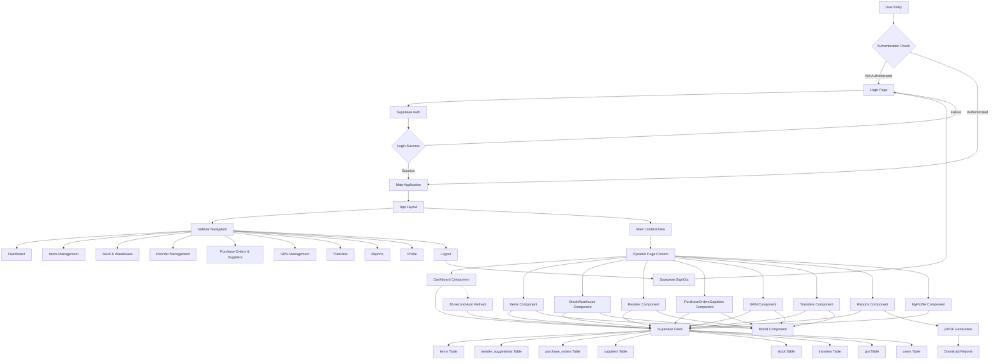

## Component Architecture

### 1. Core Components
- **App.jsx**: Main application router and layout manager
- **Sidebar.jsx**: Navigation component with authentication-aware menu
- **Header.jsx**: Top navigation bar (if present)
- **Modal.jsx**: Reusable modal for forms and confirmations

### 2. Page Components Structure

#### Dashboard (`/`)
- Real-time statistics fetching
- Auto-refresh every 30 seconds
- Key metrics display:
  - Total Items
  - Low Stock Alerts
  - Critical Stock
  - Pending Reorders
  - Active Suppliers
  - Expiring Soon

#### Items Management (`/items`)
- CRUD operations for inventory items
- Item categorization
- Stock level tracking
- Supplier associations

#### Stock & Warehouse (`/stock`)
- Multi-warehouse support
- Stock level monitoring
- Location-based inventory
- Stock movement tracking

#### Reorder Management (`/reorder`)
- Automated reorder suggestions
- Severity-based alerts (warning/critical)
- Reorder approval workflow
- Supplier integration

#### Purchase Orders & Suppliers (`/purchase-orders-suppliers`)
- Purchase order creation and management
- Supplier database
- PO status tracking
- Supplier performance metrics

#### GRN Management (`/grn`)
- Goods Receipt Note processing
- Delivery verification
- Stock update automation
- Quality control integration

#### Transfers (`/transfers`)
- Inter-warehouse transfers
- Transfer request workflow
- Transfer status tracking
- Inventory reconciliation

#### Reports (`/reports`)
- PDF report generation
- Data visualization with Recharts
- Custom date range filtering
- Export functionality

#### Profile (`/profile`)
- User profile management
- Authentication settings
- User preferences

## Data Flow Patterns

### 1. Authentication Flow
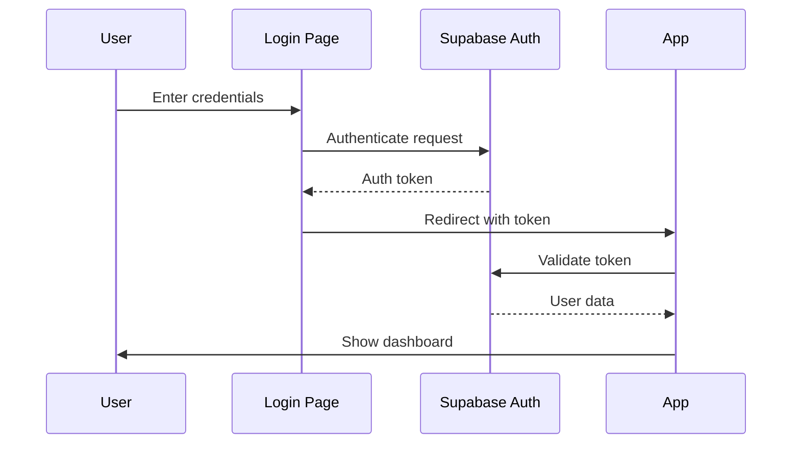

### 2. Data Fetching Pattern
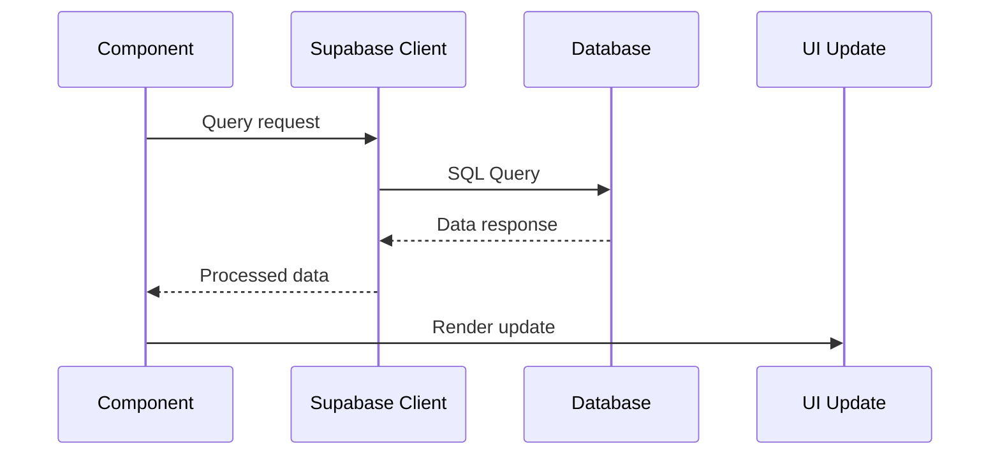

### 3. Real-time Updates
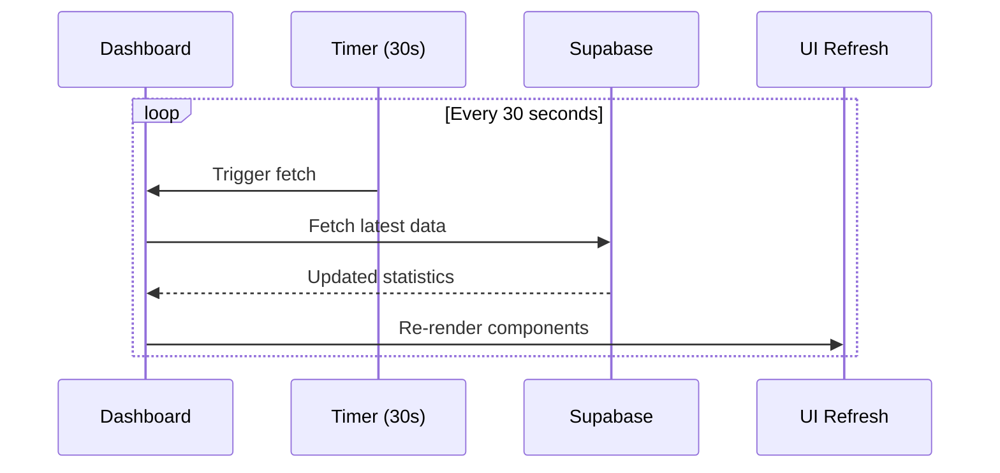

## State Management
- **Local State**: useState hooks for component-level state
- **Authentication**: Supabase auth session management
- **Data Caching**: Component-level data caching with refresh intervals
- **Real-time**: Polling-based updates for dashboard metrics

## Security Features
- Supabase Row Level Security (RLS)
- JWT-based authentication
- Route protection for authenticated pages
- Environment variable configuration for API keys

## Performance Optimizations
- Component-based lazy loading potential
- Efficient data fetching with specific queries
- Auto-refresh intervals for real-time data
- PDF generation on-demand

## Integration Points
- **Backend API**: Supabase REST API
- **Authentication**: Supabase Auth service
- **File Storage**: Supabase Storage (if used)
- **Real-time**: Supabase Realtime subscriptions (potential enhancement)

This architecture provides a scalable, maintainable frontend system with clear separation of concerns and efficient data management patterns.

# System Operation Flow

## User Journey Scenarios

### 1. Complete Inventory Management Workflow

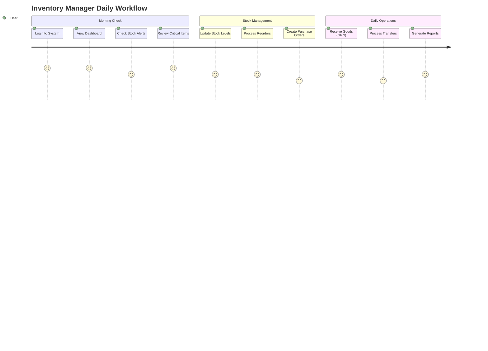

### 2. Real-time Data Flow Demonstration

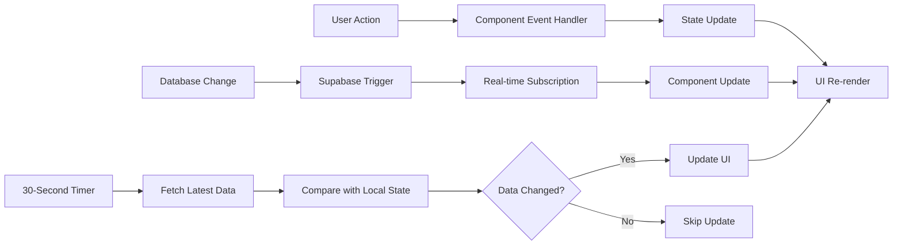

### 3. Purchase Order Lifecycle

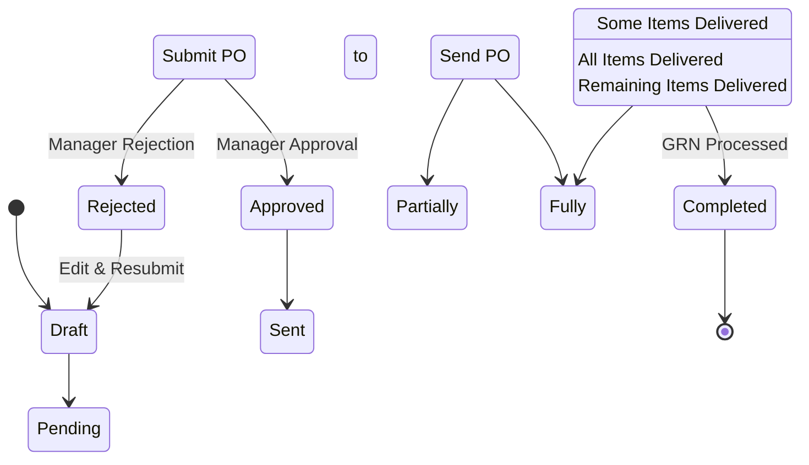

## Interactive Component Flow

### Dashboard Real-time Updates

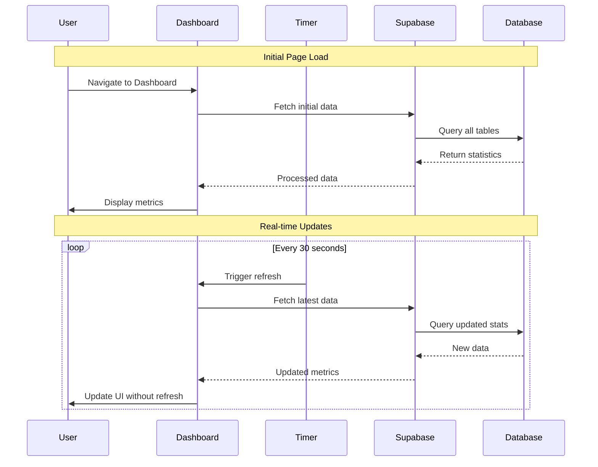

### Multi-step Workflow: Stock Reorder Process

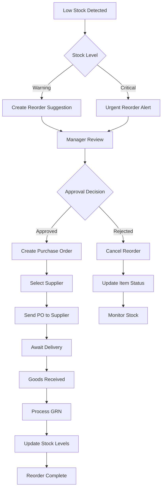

## Component Interaction Patterns

### Modal-based CRUD Operations

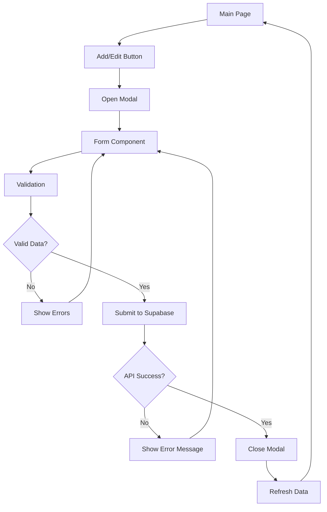

### Navigation State Management

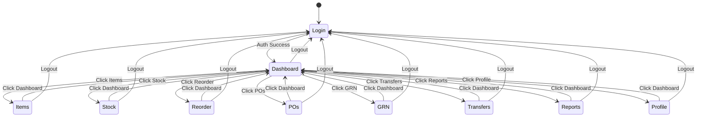

## Performance & User Experience Flow

### Loading States and Error Handling

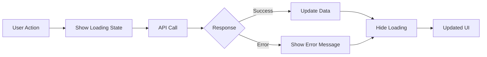

### Data Caching Strategy

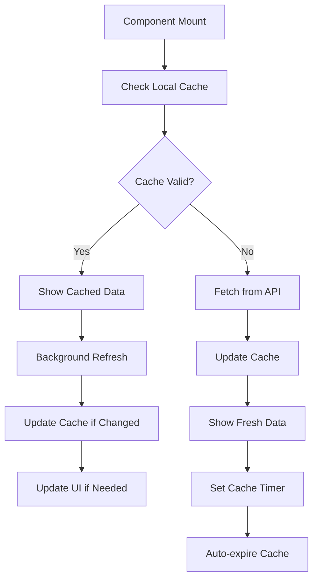

## System Response Time Flow

```mermaid
gantt
    title System Response Timeline
    dateFormat X
    axisFormat %s
    
    section User Interaction
    Click Action    :0, 0.1s
    Component Update :0.1, 0.2s
    
    section API Communication
    API Request     :0.2, 0.4s
    Database Query  :0.4, 0.8s
    Response Return :0.8, 1.0s
    
    section UI Updates
    State Update    :1.0, 1.1s
    Re-render       :1.1, 1.3s
    User Sees Result :1.3, 1.3s
```

This comprehensive flow demonstrates how the system operates in real-world scenarios, showing the complete user journey from login through various inventory management operations, with emphasis on real-time data updates and smooth user experience.
